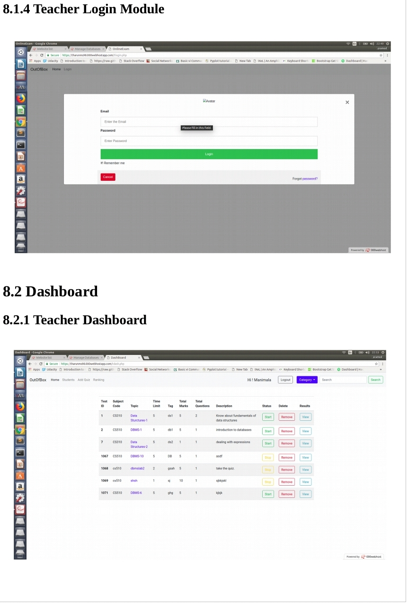

# Online-Examination-Website
The Project ,Online Examination Primarily Designed and Developed For The Ease Of Conducting test and Quzzies Online.

## Running the tests

Features

```
1) **Authentication Interface** is provided for staff to login into Online
Examination, which provides an option to login using registered email id of
the staff. Sign up facility is also provided for the students, also admin has a
login which enables the admin to keep track of everything going on.
2) **Data entry Interface** is provided to entry the questions,answers and along with the timer. It is
loaded after teacher has successfully logged in to the system.
3) **Examination Interface** Which allows the student to take quiz given by the respective teacher in a specified time
4) **Summary Details Interface** is provided to Teachers and student to show
visualization of result and analysis.
```





## Deployment
This online examination site was intially deployed in hostinger web hosting
platform. The values entered on the web page were stored in a database.The
values entered include details about the student,teacher,courses enrolled,
department handled,semester etc. This project aims to eliminate the
inconsistency by centeralizing the process onto a Database.

## Built With


* **Architectural Model**
The model chosen for implementation is Hybrid Model. Layered approach is
followed in internal software design. Client Server Architecture is employed
for end-user connections.7.2. Model Details
The product architecture can be treated as the hybrid of 2 models, as stated
above. This section aims to provide the detail of each models while providing
the justification.
* **Layered Model**
Layered Model is employed at the System Core. It consists of 4 different
layers each performing the functions at different level of Abstraction.
* **Hardware Layer**
It is the core layer of the Core System Architecture. It consists of Ubuntu
Server or Workstation connected to Local Area Network. Any user connected
to same LAN is able to connect to the core server.
* **Server Layer**
It is the layer which offers the services the end user computers. It consists of
a software servers up and running. MySQL server is used as Database Server.
* **Computation and I/O Layer**
This layer consists the core of the proposed system. It provides functionalities
of I/O to DBMS. After the test is done and required data is accumulated, this
layer also provides the service to see their score and their rankings with
respect to other students who have taken that test. This layer is implemented
in PHP.
* **User Interface Layer**
This layer is directly accesed by the user. This layer provides the interaction
logic and the interface. Primary data validations are conducted at this
interface to reduce the processing and communication effort between the
layers. This layer is implemented in HTML,CSS, JavaScript and AJAX.
* **Client Server Architecture**
Client Server architecture is used to interface between the system and the end
users. End users are connected to the LAN to which the Server is connected.
Single server must be able to cater to multiple users simultaneously
* **Sequential Architecture**
Sequential architecture is used to feed the data from external softwares and
services to the product database. The data is fed to External Data Interface
Programs and Scripts to extract required data and then directly inserted into
the database.


## Authors

* **Shivashankar H C**  - [Shivu](https://github.com/shiv-u/facial_expression_recognizer)


